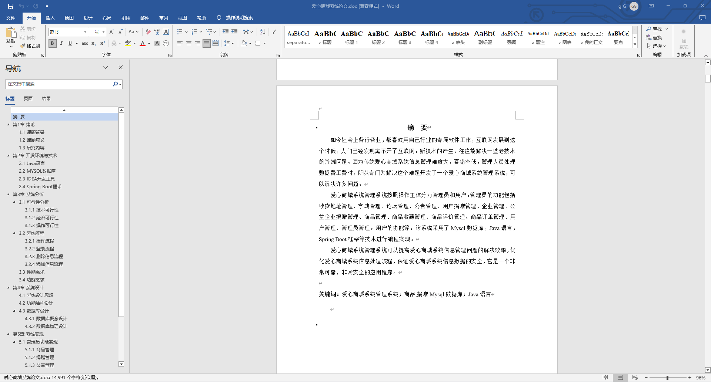
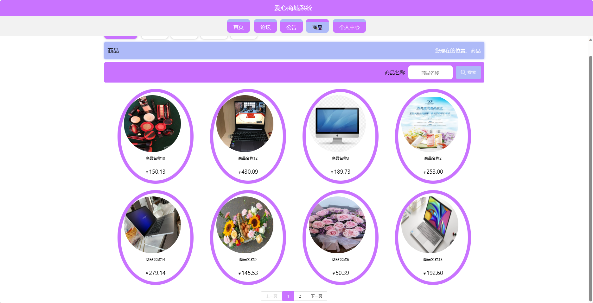
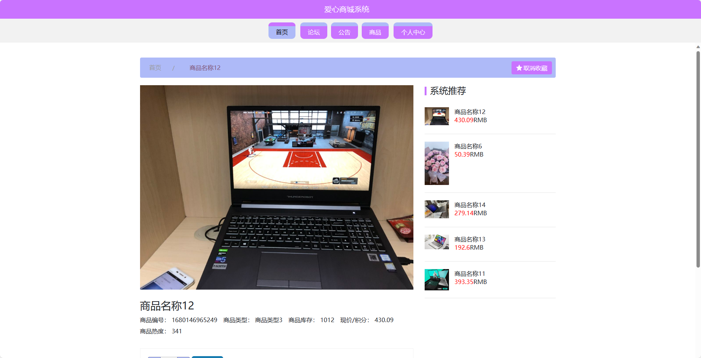
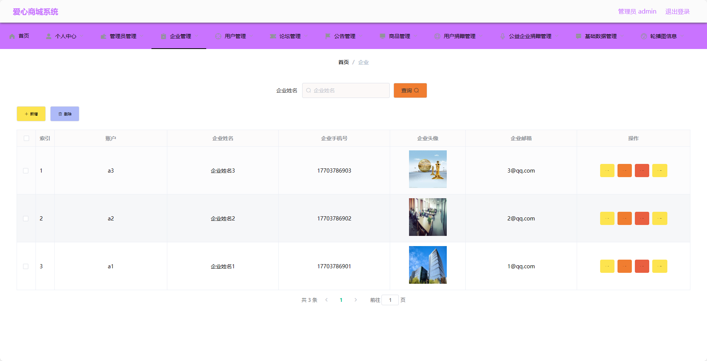
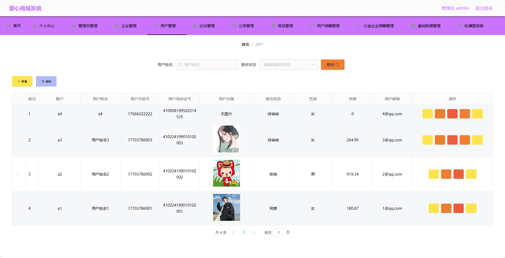

## 基于SpringBoot的爱心商城系统(程序+报告)

###  获取sql数据库文件: 从戎源码网 (https://armycodes.com/) QQ: 386869957 QQ群: 377586148
###  所有系统地址: (https://github.com/YuLin-Coder/AllProjectCatalog) 
###  所有项目以及源代码本人均调试运行无问题 可支持远程安装部署调试、定制修改、代码讲解

## 项目介绍
基于SpringBoot的爱心商城系统，系统包含两种角色：管理员、用户,系统分为前台和后台两大模块，主要功能如下

### 【管理员】:
- 个人中心：管理员可以管理个人信息，修改密码等。
- 管理员管理：管理员可以管理其他管理员的信息，包括添加、编辑和删除管理员账号。
- 企业管理：管理员可以管理企业信息，包括添加、编辑和删除企业账号。
- 用户管理：管理员可以管理用户信息，包括添加、编辑和删除用户账号。
- 论坛管理：管理员可以管理论坛板块，包括审核话题、回复用户等。
- 公告管理：管理员可以发布、编辑和删除公告信息。
- 商品管理：管理员可以管理商品信息，包括添加、编辑和删除商品。
- 用户捐赠管理：管理员可以管理用户的捐赠记录，包括捐赠金额、捐赠时间等。
- 公益企业捐赠管理：管理员可以管理公益企业的捐赠记录，包括捐赠金额、捐赠时间等。
- 基础数据管理：管理员可以管理系统的基础数据，包括商品分类、企业类型等。
- 轮播图信息：管理员可以管理轮播图信息，包括添加、编辑和删除轮播图。

### 【企业】:
- 个人中心：企业可以管理个人信息，修改密码等。
- 论坛管理：企业可以管理论坛板块，包括审核话题、回复用户等。
- 公告管理：企业可以发布、编辑和删除公告信息。
- 商品管理：企业可以管理商品信息，包括添加、编辑和删除商品。
- 公益企业捐赠管理：企业可以管理公益企业捐赠信息，包括捐赠金额、捐赠时间等。
- 轮播图信息：企业可以管理轮播图信息，包括添加、编辑和删除轮播图。

### 【前台】:
- 首页：展示平台的最新动态、热门商品、公益企业捐赠信息等内容。
- 论坛：用户可以在论坛上进行交流。
- 公告：展示平台发布的公告和通知信息。
- 商品：用户可以浏览、搜索、购买商品。
- 个人中心：用户可以管理个人信息，包括修改密码、查看订单历史、捐赠记录等。

## 项目技术
- 编程语言：Java
- 数据库：MySQL
- 项目管理工具：Maven
- 前端技术：HTML、CSS、JavaScript、Jquery、Vue
- 后端技术：Spring、SpringMVC、MyBatis

## 运行环境
- JDK版本：JDK1.8及以上
- 开发工具：IDEA、Ecplise、Myecplise都可以
- 数据库: MySQL5.7及以上
- Maven：maven3.0及以上
- Node：14.14.0及以上

## 运行截图

